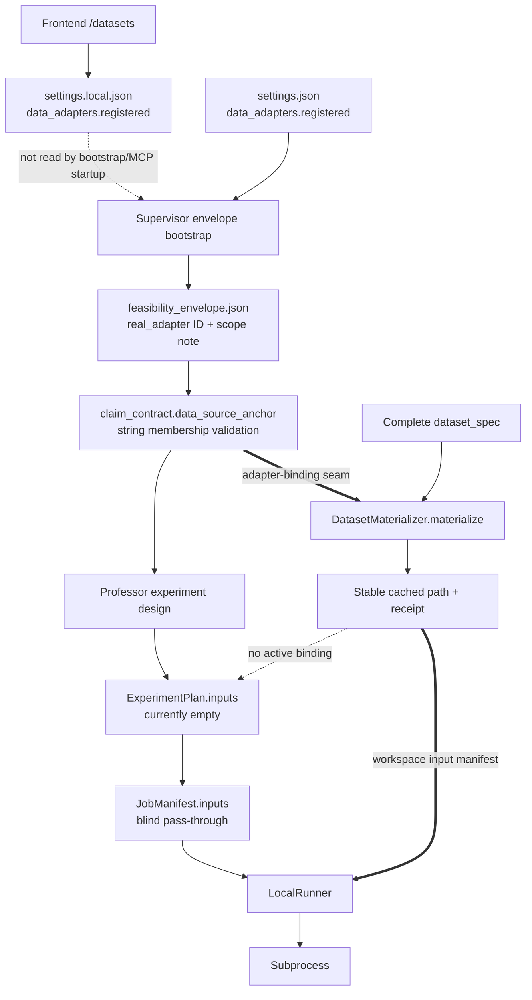

# Data adapter architecture

## Overview

The active production pipeline does not currently have an executable data-adapter abstraction. It has a **registry declaration**: a JSON record says that an adapter ID exists, the feasibility envelope repeats that ID, and a claim names it through `claim_contract.data_source_anchor`. Those steps constrain what the Professor may claim, but they do not select, probe, materialize, or deliver data to an experiment.

Executable data acquisition exists elsewhere. `research_harness.datasets` defines type-keyed materializers that turn a complete `dataset_spec` into a stable local path and a receipt. That path is used by the legacy research refiner, which the frontend explicitly removed from its active phase sequence. Meanwhile, the active experiment pipeline already carries an `inputs` object from `ExperimentPlan` to `JobManifest`, but Professor-generated plans default it to empty and `LocalRunner` does not expose it to the subprocess. The important architectural seam is therefore **adapter binding between claim selection and experiment execution**: resolve the claim's anchor against one probed registry, materialize through the existing dataset machinery, and publish the resulting workspace-local input manifest through the existing plan/manifest transport.

## Key Concepts

### Registry declaration

`settings.json` and `settings.local.json` store `data_adapters.registered[]`. A frontend-created entry has `id`, `kind`, `source`, `provenance`, a fixed `module` string, and optional upload metadata (`research_harness/frontend/datasets.py:246-310`). The checked-in OKX entry is even thinner: it has an ID, `kind="real_panel"`, and prose provenance, but no `source` (`settings.json:2-17`). Its usable path is configured independently as `runtime.llm_orchestrator.mcp.server_env.COIN_DATA_DIR` (`settings.json:176-185`).

This record is a declaration of availability, not an object with a load or probe operation. `FIELD_REGISTRY` models the whole collection only as an operator-writable `list`; it does not validate individual adapter fields (`research_harness/settings_scoped.py:98-142,509-581`).

### Feasibility envelope

`FeasibilityEnvelope.data_sources_available[]` is the thread-level capability declaration written before claim design. Each data-source entry contains only `kind`, `id`, and an optional `scope_note` (`research_harness/schemas/feasibility_envelope.schema.json:17-30`). `thread_supervisor.bootstrap_envelope_if_missing()` projects every project registry dictionary with an `id` into `kind="real_adapter"`, dropping source, module, original kind, upload hash, and size (`research_harness/thread_supervisor.py:303-354`).

The envelope answers “what may this thread claim it can access?” It does not answer “how will this node open that data?”

### Data-source anchor

`claim_contract.data_source_anchor` is an ID string persisted on a node. `validate_claim_fits_envelope()` checks string membership against the envelope, and for deployment claims also checks the project registry ID set (`research_harness/orchestrator/llm_orchestrator/persona_validator.py:709-892`). The anchor is useful policy metadata, but no active code resolves it into a source path or dataset object.

### Dataset materializer

`DatasetMaterializer` is the executable acquisition boundary. Implementations accept a complete `dataset_spec` and cache root, then return `MaterializeResult` with status, stable path, size, fetcher type, and details (`research_harness/datasets/protocol.py:17-58`). The hard-coded registry dispatches by `dataset_spec.type`, not adapter ID (`research_harness/datasets/registry.py:23-37,52-115`). `LocalPathMaterializer` verifies that a path exists, copies it into `.dataset_cache`, and returns the materialized path and byte count (`research_harness/datasets/local_path.py:19-66`).

This is the repository's real fetcher interface. It is disconnected from `data_adapters.registered[]` and `data_source_anchor` in the active production path.

### Experiment and job inputs

Both `ExperimentPlan` and `JobManifest` require an unstructured `inputs` object (`research_harness/schemas/experiment_plan.schema.json:6-24,77-78`; `research_harness/schemas/job_manifest.schema.json:6-20,63-64`). `build_job_manifest_from_experiment_plan()` copies it unchanged (`research_harness/orchestrator/experiment_plan.py:703-726`). This is an existing transport seam, not a working adapter binding: the Professor currently emits `{"datasets": [], "snapshots": []}` (`research_harness/orchestrator/llm_orchestrator/professor.py:947-956`), and `LocalRunner.execute()` constructs the command and launches it without reading `manifest["inputs"]` (`research_harness/runner/local_runner.py:105-188`).

## How It Works

### 1. The operator registers a declaration

The `/datasets` page supports uploading a file or registering an absolute path (`research_harness/frontend/templates/datasets.html:84-147`; routes at `research_harness/frontend/server.py:1620-1714`). Uploading is the stronger of the two operations: it streams into `.dataset_cache/operator_uploads/<id>/`, enforces an extension allowlist and size cap, computes SHA-256, and atomically renames the completed file (`research_harness/frontend/datasets.py:130-185`).

`register_adapter()` validates the ID syntax, a purpose-like `kind`, source-string shape, and non-empty provenance. It does not test that a register-by-path source exists or is readable (`research_harness/frontend/datasets.py:246-287`). It atomically persists the declaration to `settings.local.json` (`research_harness/frontend/datasets.py:291-310`). Registration therefore means “the operator named this resource,” not “the harness proved it is ready.”

There are three different resolution policies at this point:

- `list_adapters()` merges project and operator entries by ID for display (`research_harness/frontend/datasets.py:313-330`).
- `ResolvedSettings` recursively overlays settings but whole-replaces lists, so any operator registry list replaces the project list (`research_harness/settings_scoped.py:400-446`).
- The production supervisor and MCP process read only `settings.json`, so operator entries written by `/datasets` do not participate in their adapter checks (`research_harness/thread_supervisor.py:324-334`; `research_harness/mcp_server.py:5855-5882`).

### 2. The frontend starts the production supervisor

The old in-process production endpoint is deliberately disabled. The normal frontend action starts `python -m research_harness.thread_supervisor watch ...` as a detached subprocess (`research_harness/frontend/server.py:600-680,1277-1293`). The legacy research refiner is also explicitly removed from the frontend pipeline (`research_harness/frontend/server.py:48-56`).

At startup, `watch_thread()` calls `bootstrap_envelope_if_missing()` (`research_harness/thread_supervisor.py:863-941`). Bootstrap directly parses project `settings.json`, takes `data_adapters.registered`, and turns every record with an ID into a `real_adapter` entry. It does not call the declared module, examine `source`, or invoke a `DatasetMaterializer`. Once the envelope file exists, bootstrap leaves it untouched on later cycles (`research_harness/thread_supervisor.py:320-354`).

### 3. The envelope limits the claim by identity

The MCP tool `design_initial_claim_contract` reads the envelope and constructs a set of registered project adapter IDs (`research_harness/mcp_server.py:2148-2218`). `validate_claim_fits_envelope()` then applies scope rules:

- `directional` accepts any data situation.
- `feasibility` accepts `synthetic:*` or an ID present in the envelope.
- `deployment` requires a real-adapter ID in the envelope and the project registry.

After validation, the selected anchor string is persisted in the root claim and search state (`research_harness/mcp_server.py:2222-2320`). Nothing at this boundary proves that the source exists, that its shape fits the proposed experiment, or that its loader can execute.

`design_experiment_template` can add a second, textual guard. If `execution_constraints.required_data_sources` contains a marker, the handler rejects Professor source that does not contain that literal substring (`research_harness/mcp_server.py:2438-2473`). This proves that generated source mentions an ID or path; it does not prove that the program opens the registered resource.

### 4. The active experiment path creates empty input transport

`handle_execute_node_experiment()` is the active node execution coordinator. It loads the node, builds an experiment plan from the Professor template, writes `experiment_plan.json`, derives and writes `job_manifest.json`, invokes `LocalRunner`, and converts runner output into a worker report (`research_harness/mcp_server.py:2512-2595`).

For Professor templates, `_build_plan_from_professor_template()` copies metadata inputs or defaults to empty datasets and snapshots (`research_harness/orchestrator/experiment_plan.py:249-327`). Professor's coercion currently supplies that empty default explicitly (`research_harness/orchestrator/llm_orchestrator/professor.py:947-956`). `build_job_manifest_from_experiment_plan()` preserves it exactly, so the transport field survives, but it carries no adapter binding (`research_harness/orchestrator/experiment_plan.py:703-726`).

`LocalRunner` validates workspace containment, executable allowlisting, command tokens, claim shape, source files, and output paths. It then runs the entrypoint with `cwd=workspace` (`research_harness/runner/local_runner.py:52-128`). It neither validates nor serializes `manifest["inputs"]`, and it does not pass an inputs-manifest path to the child. Topic-specific data access therefore depends on experiment source knowing an ambient path or environment convention. The checked-in OKX setup uses exactly that escape hatch through `COIN_DATA_DIR`, separate from the adapter declaration.

### 5. The executable materializer remains on the legacy side

The research refiner's `PROPOSE_DATASET` action receives a complete `dataset_spec`, calls `materialize()`, and records successful results in `dataset_manifest.json` (`research_harness/agents/research_refiner.py:263-280,829-835`). That manifest contains the original spec, materialized path, verification time, byte size, fetcher type, and details (`research_harness/schemas/dataset_manifest.schema.json:20-35`).

This is a useful acquisition receipt, but the active frontend-to-supervisor path never runs the refiner, never resolves a claim anchor into one of those specs, and never copies such a manifest into the node workspace.

### 6. The exact ownership seam

The clean seam sits after the claim has selected `data_source_anchor` and before `ExperimentPlan` is finalized. One adapter-binding boundary must own the complete transition from **declared identity** to **executable input**:

1. Parse project and operator declarations under one deterministic precedence rule.
2. Resolve the claim's real anchor to exactly one declaration.
3. Probe readiness before treating the adapter as feasible: malformed, missing, unreadable, or mismatched data fails here.
4. Convert the declaration into the existing complete `dataset_spec` shape and call the existing `DatasetMaterializer`; acquisition remains owned by `research_harness.datasets`.
5. Record a stable, idempotent binding receipt containing the selected ID, materialized path, provenance, and materialization details.
6. Put a workspace-local manifest reference into `ExperimentPlan.inputs`, preserve it in `JobManifest.inputs`, and make `LocalRunner` expose that stable reference to the subprocess.

This seam owns selection, readiness, and delivery. It does not own topic-specific parsing, model training, result interpretation, a dynamic Python plugin system, or a second fetcher framework. For the frozen arXiv acceptance experiment, the experiment remains responsible for reading the bound taxonomy and evaluating the character n-gram, word-unigram, majority, and label-shuffle baselines; the binding layer is responsible only for guaranteeing which probed file it received and where to find it.

### 7. Terminal behavior is downstream of binding

The supervisor repeatedly drives MCP work until `is_terminal()` recognizes a persisted publication outcome (`research_harness/thread_supervisor.py:969-976`). A directional real-data experiment can terminate honestly as `accept_with_unverified_screen` once the attestation and honest paper are persisted; a positive `goal_achieved` outcome additionally requires a passing operator-owned real falsifier (`research_harness/thread_supervisor.py:116-184`). Adapter binding makes the experiment grounded, but it does not weaken or replace that publication gate.

## Where Things Live

- `settings.json` — checked-in registry declaration and the independent OKX `COIN_DATA_DIR` environment configuration.
- `research_harness/frontend/datasets.py` — upload, shallow registration validation, operator persistence, UI merge, and deletion.
- `research_harness/settings_scoped.py` — project/operator/thread settings model and its whole-list replacement semantics.
- `research_harness/thread_supervisor.py` — active production loop, feasibility-envelope bootstrap, and terminal detection.
- `research_harness/mcp_server.py` — claim anchoring, source-marker gate, experiment execution coordination, falsifier, and attestation tools.
- `research_harness/orchestrator/llm_orchestrator/persona_validator.py` — envelope-versus-claim scope and ID checks.
- `research_harness/datasets/` — the executable materializer protocol, dispatcher, and local/Hugging Face/synthetic implementations.
- `research_harness/agents/research_refiner.py` — legacy materialization loop and dataset-manifest production.
- `research_harness/orchestrator/experiment_plan.py` — active plan construction and `ExperimentPlan.inputs` to `JobManifest.inputs` pass-through.
- `research_harness/runner/local_runner.py` — bounded subprocess execution; current endpoint of the missing input-delivery bridge.
- `research_harness/schemas/{feasibility_envelope,experiment_plan,job_manifest,dataset_manifest}.schema.json` — persisted shapes at each boundary.

## Gotchas

- **“Adapter” is overloaded.** `data_adapters.registered` is metadata; `DatasetMaterializer` is executable. The current code does not connect them.
- **The frontend's success message means persisted, not ready.** Register-by-path accepts an absolute-looking path without checking existence. Upload is stronger because it has already written and hashed bytes.
- **Operator adapters disappear on the active production path.** The UI writes `settings.local.json`; bootstrap and the MCP server use project-only `settings.json`.
- **UI merge is not runtime merge.** The UI merges entries by ID, while `ResolvedSettings` replaces the whole list. Neither behavior is what the production supervisor currently uses.
- **Any project ID becomes “real.”** Envelope bootstrap ignores the declared kind and source readiness. The current `real_panel` kind is also not a key in the executable materializer registry.
- **Mentioning data is not loading data.** `required_data_sources` is a literal source-text scan.
- **The current Professor path has a misleading comment.** `_materialize_professor_template()` says it drops legacy `inputs`, but its comprehension removes only `source_files` (`research_harness/orchestrator/experiment_plan.py:218-225`). In practice the Professor already emits empty inputs, so this inconsistency does not create a data binding.
- **The manifest transport is permissive.** Both schemas type `inputs` only as `object`; neither describes a dataset binding contract.
- **Runner reproducibility currently stops at code and command.** `LocalRunner` records source files, command, logs, and result, but no input receipt in `runner_result` (`research_harness/runner/local_runner.py:190-231`).
- **Real falsification is a separate trust boundary.** For `real_holdout`, the harness deterministically evaluates an operator-supplied scalar; it does not obtain that scalar by executing the registered adapter (`research_harness/falsifier.py:412-454`). Binding the experiment input does not itself certify transfer validity.
