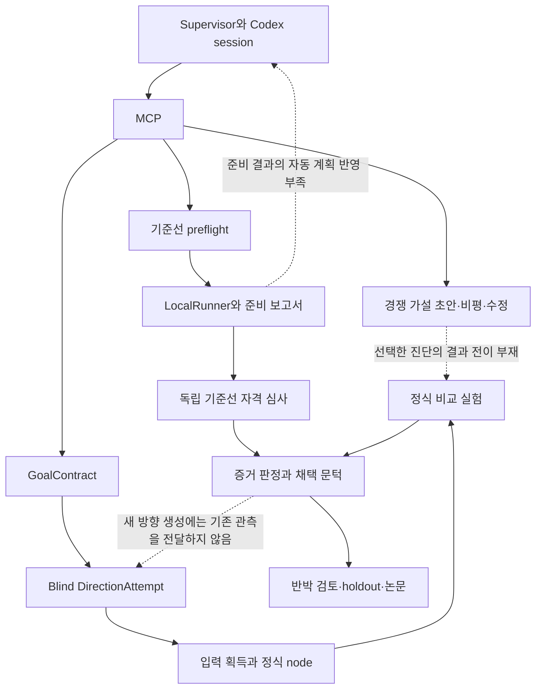

# 증거를 다음 연구 결정으로 연결하기

2026-09-05. Pacman E2E 실행과 현재 production 호출 경로를 기준으로 작성했다. 버그 수정과 아직 구현하지 않은 설계를 구분한다. 이 문서는 새 연구 정책의 제안이며 ADR 0014를 자동으로 대체하지 않는다.

## 결론

현재 harness는 성공을 잘못 선언하지 않도록 검사하는 기능에 비해, 불확실성을 줄이는 다음 연구 작업을 고르는 기능이 부족하다. 프로세스가 살아 있고 코드가 바뀌는 것은 연구 진전의 충분조건이 아니다. 반대로 실험 점수가 오르지 않더라도 특정 설명을 배제하거나 측정 오류를 발견했다면 진전일 수 있다.

성공 선언의 문턱을 낮추는 것으로는 해결되지 않는다. 실행의 유효성, 현상의 재현, 경쟁 설명의 구별, 기여의 검증을 각각 증거로 관리하고 다음 행동을 그 증거에서 선택해야 한다. 이 기능은 특정 RL 학습기를 제공하는 것이 아니라 harness가 스스로 학습기를 만들고 검증하는 일을 이끌어야 한다.

## 현재 모듈과 호출 지도

별도 glossary 파일은 발견하지 못했다. 아래 용어는 ADR 0013/0014와 실제 타입을 따른다. `docs/ARCHITECTURE.md`의 forest, live gate, Claude 중심 설명 일부는 현재 production 경로와 다르므로 현재 호출 코드를 우선했다.

| 용어 / 책임 | 현재 모듈과 호출자 | 관측된 제약 |
|---|---|---|
| Supervisor: 프로세스 실행과 재개 | `thread_supervisor.py` → Codex session → MCP | 무응답 watchdog이 있음. 한 session 내부의 의미적 반복을 제어하는 결정 경계가 없음 |
| GoalContract: 고정된 질문과 성공 기준 | `mcp_server.handle_advance_research` → `blind_sequential_research._load_or_migrate_locked` → `goal_contract.py` | 방향 생성 전 동결. 현재 계약에는 TBD와 미완성 조건이 남음 |
| Prospective hypotheses: 경쟁 설명과 진단 후보 | MCP `develop_research_hypotheses` → `hypothesis_development.py` | 독립 draft/critique/revision을 제공하지만 선택된 진단의 실행 결과를 받는 전이가 없음 |
| DirectionAttempt: 현재 정식 가설 방향 | `blind_mcp_adapter.CodexBlindDirectionGenerator` → `blind_sequential_research` | 생성 입력이 GoalContract와 random_perspective 두 개로 제한됨. 이전 관측과 가설 catalog를 읽지 못함 |
| AcquisitionManifest: 입력 획득과 provenance | `advance_research` → acquisition → `_materialize_direction` | 실제 입력에 바인딩한 node를 생성함 |
| Baseline preparation: 비교 실험 전제 확보 | MCP `execute_baseline_preflight` → `runner/baseline_preflight.py` → LocalRunner → worker_report | 정식 attempt와 별도로 저장. 과거에는 get_state에도 준비 결과 요약이 없었음 |
| Baseline qualification: 기준선 자격 심사 | MCP `submit_baseline_qualification` → `memory/baseline_review.py` → 독립 review | 부적격 비교의 채택을 막음. reject 후 무엇부터 해결할지는 주 session에 맡김 |
| ExperimentPlan / worker_report: 실험과 결과 | `design_experiment_template` → `execute_node_experiment` → LocalRunner → evidence | 현재 active claim에서는 아직 이 경로를 실행하지 못함 |
| AttemptEvidence: 유효한 결과의 해석 | `attempt_evidence.py` → `blind_sequential_research._evaluate_evidence_locked` | 실행 실패와 과학적 반박을 구분함. 준비 작업의 실패는 이 경로에 도달하지 않음 |
| StrongResult / publication | `strong_result.py`, MCP attestation, `publishing/*` | 검증된 결과와 논문 산출물을 묶음. 실행·리뷰 통과 자체가 외부 학회 수준을 증명하지는 않음 |

## 실제 병목의 증거

22:14 재시작 이후 진단 시점의 완료 MCP 호출은 기준선 preflight 11회 약 1,583초, 가설 개발 3회 약 438초였다. 정식 claim의 experiments, observations, transitions는 모두 0이었다. 전체 준비 실행은 당시 디렉터리 63개, runner receipt 61개, 누적 runner 경과시간 약 8,468초였다. 이후 실행은 계속되므로 이 숫자는 당시 스냅샷이다.

QMIX qualification 01은 실제 실행 후 음식 반환 0, greedy 대비 점수 차이 -1.1333을 기록했다. 독립 검토는 순차 행동 시점과 공동 학습 전이의 불일치 및 서로 다른 greedy 구현을 지적했다. qualification 05도 음식 반환 0, 차이 -35.6667이었다. qualification 02/03/04는 각각 팀 인덱스 가정, 문법, 집계 키 오류로 실패했고 06은 377.6초 뒤 불법 행동 오류로 종료됐다.

이는 '대칭 고착 가설이 거짓'이라는 증거가 아니다. 아직 그 가설을 검증할 유효한 실험 장치를 확보하지 못했다는 증거다. 현재의 병목은 baseline competence만으로도 충분히 설명되지 않는다. 구현 적합성과 학습 능력을 한 번의 큰 실행에서 검증하려는 작업 분해 문제도 있다.

원본 근거는 `runs/threads/thread_07b175cc/production/tree/baseline_preflight/`, `market/baseline_reviews/independent/0dd9c9731cac66fd583b8df7b5808e36460b3f1c0edf6d0f4579f712e32b374d/review.json`, `production/tree/search_state.json`, `codex_subprocess.events.jsonl`이다.

## 이번에 수정한 단순 오류

- 가설 개발 재개를 자연어 revision_request의 해시에 의존하던 문제. 진행 중인 round는 저장된 context로 재개하며 run_id를 명시해 재개·재조회할 수 있다. 새로운 문구는 진행 중 round를 초기화하지 않는다. 새 근거에 따른 새 round는 기존 round 완료 후 시작한다.
- 완료된 preflight 결과를 재조회해도 새 실행 예산을 요구하던 문제. 같은 실행 계획의 저장 결과는 추가 실행 없이 재검증해 반환하고, 새 실행에만 남은 예산을 검사한다.
- 준비 실행을 주 agent가 get_state에서 파악하지 못하던 정보 누락. 저장된 runner/report로 실행 실패, 비교 실패, 미심사 실행 완료, 미완료를 구분해 요약한다. 최신 준비 증거를 다음 가설 round와 supervisor 재개에도 전달한다. 이 요약은 과학적 승인이나 claim 반박을 생성하지 않는다.

추가 점검에서 독립 리뷰 원본 경로를 읽지 않는 것을 버그로 의심했으나, 실제로는 최신 리뷰가 기존 경로에도 복제되어 있었다. 현재 실행에서 리뷰가 누락됐다는 가설은 기각했고 해당 코드 변경과 테스트는 제외했다.

재개 중 context가 고정되는 것은 의도된 동작이다. 비교적 짧은 비평 round 안에서 평가 대상이 계속 바뀌는 문제를 방지한다. 새 근거를 반영하려면 완료 후 새 round를 시작해야 한다. 준비 요약은 전체 문맥을 대체하지 않으며 필요한 원본 보고서 경로를 포함한다. 프로세스가 살아 있는지는 별도로 확인해야 한다.

## 관련 연구가 알려주는 것과 알려주지 않는 것

[AI Scientist-v2](https://arxiv.org/html/2504.08066v1)는 최소 구현, 튜닝, 연구 실험, ablation을 나누고 실행 가능한 산출물을 다음 단계로 넘긴다. 여기서 가져올 원리는 전제가 확보된 뒤 비싼 실험을 한다는 것이다. 해당 논문의 검증은 workshop 결과이며 main-conference 수준을 일반적으로 달성했다는 근거는 아니다.

[ARTS](https://arxiv.org/html/2606.21891v2)는 낮은 실험 점수가 가설 문제인지 구현 문제인지 실행 기록을 보고 판단하도록 한다. 이 구분은 현재 Pacman 병목과 직접 관련된다. 그러나 ML benchmark 성능 향상을 논문 신규성이나 publication 품질의 증명으로 해석해서는 안 된다. 모델 가중치를 추가 학습하는 방법까지 이 프로젝트에 도입할 근거도 아직 없다.

[Agent Laboratory](https://arxiv.org/html/2501.04227v1)는 자동 평가가 사람 평가보다 연구 품질을 높게 평가하는 차이를 보고한다. 따라서 여러 LLM 리뷰의 동의만으로 publication level을 판정하면 안 된다. 여기서 human feedback 기능을 복원하자는 결론은 나오지 않는다. hands-off 실행에서는 코드·측정·주장 간 연결과 외부 평가 기준을 더 직접적으로 확인해야 한다.

이하 설계는 위 논문을 그대로 복제한 것이 아니라 현재 코드와 실행 증거에서 도출한 제안이다.

## 사용자가 보낸 SDE 글의 반영

[사용자 참고 글](https://x.com/CrazyShyyt/status/2096136487536652376)은 [Evaluating Large Language Models in Scientific Discovery](https://arxiv.org/html/2512.15567v1)를 소개한다. X 직접 접근은 403이었고, 같은 status ID의 공개 API 응답에서 본문을 확인한 뒤 논문 원문을 대조했다.

원문은 정적 문항 평가와 프로젝트 수준의 반복 탐색을 구분한다. 과학 분야의 모델 간 공통 오류, 추론·규모 증가의 체감 효과를 보고하지만, 구조화된 탐색에서의 성공 사례도 보고한다. 따라서 글의 강한 비관적 표현을 보편적 불가능성 결론으로 채택하지 않는다. 평가한 프로젝트·탐색 정책의 범위에도 한계가 있다.

설계에는 다음과 같이 반영한다. 이 항목들은 논문이 우리 harness에서 검증한 결과가 아니라 적용 제안이다.

- 같은 문제에서 여러 모델이 동의해도 검증은 끝나지 않는다. 독립성은 모델 이름보다 다른 측정 경로, 반례, 코드 실행, 원문 확인에서 확보한다.
- 개별 질문을 잘 답하는 능력과 연구를 진전시키는 능력을 따로 측정한다. 현재 사용 모델의 선택도 일반 벤치마크 순위가 아니라 단계별 실제 실패와 유효한 관측의 비율을 근거로 한다.
- 예상 밖의 관측을 실패 요약 속에 버리지 않는다. 재현 가능하고 원래 질문과 연결되는 관측이면 다음 실험의 후보로 남긴다.
- 연구자에게 더 긴 자유 추론을 요구하기 전에, 이전 관측을 보존하고 조작→관측→가설 수정의 연결이 실제로 작동하는지 확인한다.

## 필요한 연구 제어 방식

### 질문, 가설, 구현의 상태를 구분한다

ResearchQuestion은 무엇을 설명하거나 개선하려는지 나타낸다. Hypothesis는 그 질문에 대한 경쟁 설명이나 해결 방안이다. Experiment는 특정 설명을 구별하기 위한 조작과 측정이다. Implementation은 그 실험을 수행하는 코드나 증명 절차다.

한 implementation의 crash는 해당 experiment를 평가 불가능하게 만든다. 곧바로 hypothesis의 반박이 되지 않는다. 실행은 정상이어도 조작이나 측정이 부적절하면 과학적 증거가 아니다. 반대로 유효한 반례나 예상 밖의 결과는 낮은 성능 점수여도 다음 결정을 바꿀 수 있다.

정식 claim을 무조건 여러 개 생성할 필요는 없다. 하나의 claim 아래 구현 검증, 측정 검증, 경쟁 설명 검증의 작업을 별도로 추적할 수 있어야 한다. 실패한 baseline 구현을 정식 claim의 negative observation으로 복사하는 것은 잘못된 수정이다.

### 불확실성 하나를 줄이는 작업을 선택한다

다음 작업을 제안할 때 agent가 명시해야 할 것은 다음과 같다.

- 해결하려는 불확실성과 그것이 막고 있는 연구 결정.
- 현재 가능한 경쟁 설명과 각 설명이 예측하는 관측.
- 결과가 어느 쪽으로 나오든 다음 결정이 어떻게 달라지는지.
- 가장 작은 유효한 실행, 필요한 입력·구현 전제, 예상 비용.
- 결과를 믿기 위한 독립 검사와 비교 조건.

검사 양식을 더 길게 만드는 것이 목적은 아니다. 이 필드들이 같다면 코드만 조금 바꾼 전체 학습을 또 제안하지 못하도록 실행 계보와 연결해야 한다. 재현과 분산 추정은 목적이 다르므로 동일 설정 재실행을 일괄 금지해서도 안 된다.

정보이득을 LLM이 임의의 소수점 점수로 적게 만들 필요는 없다. '이 결과면 A를 배제하고, 저 결과면 B를 배제하며, 둘 다 아니면 측정을 재검토한다'는 확인 가능한 구분부터 충분하다. 연구 기여의 잠재 가치와 실행 가능성도 단일 점수로 합치지 않는다.

### 학습 가능성과 본 실험의 예산을 분리한다

이 Pacman 실행에서 필요한 단계는 게임 입출력 의미 확인, 독립 전이/측정 검증, 작은 학습 가능성 확인, 현상 재현, 경쟁 설명 판별, 개입 비교, ablation·반복 검증이다. 학습·관측 코드는 모두 harness agent가 작성한다.

작은 검사는 baseline보다 높은 점수를 요구하지 않는다. 정확한 측정, 유효한 조작, 필요한 행동/보상 경로의 관측 가능성부터 확인한다. 긴 학습은 이 전제가 확인됐을 때 시작한다. 실패 시에는 그 실패를 설명할 수 있는 검사로 돌아간다. 모든 연구를 120초로 제한하는 규칙은 부적절하다. 단계 예산은 문제에 맞춰 정하고 실제 소요 시간으로 갱신하되 최종 평가의 조건은 보존한다.

재사용 가능한 구현과 checkpoint는 hash, 설정, seed, 데이터 분할을 함께 저장한다. 평가만 실패한 경우 학습까지 재실행하지 않을 수 있지만, 방법이나 학습 의미가 바뀌면 기존 checkpoint를 섞어서는 안 된다. 이 저장 코드를 준비하는 것 역시 agent의 역할이며 root가 완성 학습기를 제공하지 않는다.

### 관측으로 탐색하되 새로운 방향을 탐색할 여지도 둔다

현재 ADR 0014는 새 방향의 입력에서 이전 관측까지 제외한다. 실패한 아이디어에 매달리지 않으려는 취지는 이해되지만, 그 규칙을 모든 새 방향에 적용하면 얻은 지식을 다음 설계에 활용할 수 없다.

권고는 관측을 활용하는 실험 설계를 기본으로 하고, 관련 없는 새 관점 생성은 별도의 탐색 행동으로 남기는 것이다. 유효한 개발 관측과 실패 원인은 보존하되 test/holdout 결과를 후보 최적화에 누설하지 않는다. 탐색의 다양성은 '실패를 무조건 잊는다'가 아니라 서로 다른 설명, 개입, 예측을 유지하는 방식으로 확보한다.

이 변경은 단순 버그 수정이 아니다. GenerationRequest의 두 필드 제한, novelty gate, attempt 전환, 테스트 및 ADR을 함께 수정해야 한다. 이번 버그 수정에서 이 경계를 몰래 완화하지 않았다.

### 연구 결정마다 supervisor가 돌아오게 한다

주 agent가 한 세션에서 끝없이 도구를 호출하도록 두지 말고, 유한한 작업 단위를 실행한 뒤 구조화된 결과로 제어권을 돌려줘야 한다. 이는 사람의 승인을 받는 단계가 아니다. supervisor가 다음 작업을 자동으로 선택하는 경계다.

진전은 실행 횟수나 claim 수로 측정하지 않는다. 새로 검증된 전제, 배제된 설명, 재현된 관측, 새로 드러난 불확실성, 재사용 가능한 검증 산출물이 생겼는지 확인한다. LLM이 '배웠다'고 쓰는 것만으로 인정하지 않고 실행 근거를 연결해야 한다.

동일 오류가 반복되면 진단 방법을 바꾼다. 정상 실행에서도 측정이 퇴화하면 측정을 검사한다. 분산이 커서 구별이 안 되면 설계나 표본 수를 검토한다. 유효하게 반박된 설명은 내려놓는다. 이런 분류에는 불확실 상태를 허용해야 하며, 횟수 상한을 넘었다고 과학적 반박으로 바꾸지 않는다.

### 최종 판정과 개발 결정을 분리한다

질문과 요구되는 증거 수준은 유지하되 개발 단계의 모든 구현 설정을 최초 가설 전에 고정하는 것은 연구를 막을 수 있다. 개발용 진단은 버전과 변경 이유를 기록하며 개선하고, 최종 비교 프로토콜은 holdout을 사용하기 전에 독립 검토와 함께 고정해야 한다. 이미 본 최종 평가 결과에 맞춰 기준을 바꾸는 것은 허용하지 않는다.

현재 TBD 계약은 단순 치환으로 해결하면 안 된다. 신규 실행은 동결 전에 필수 조건의 완결성을 확인해야 한다. 이미 동결된 실행에는 명시적인 연구 revision과 기존 증거의 사용 범위 기록이 필요하다.

또한 'publication-level paper'와 '개입이 지정 점수를 반드시 개선함'은 같은 목표가 아니다. 충분히 새로운 설명, 엄밀한 부정 결과, 불가능성 정리도 연구 기여가 될 수 있지만 현재 positive-only 종료 규칙과는 다르다. 목표를 조용히 바꾸지 말고 결과 유형별 증거 요건을 설계해야 한다. COLT 같은 이론 연구를 위해서도 real_holdout만을 모든 GoalContract의 필수 형태로 두는 구조는 재검토 대상이다. 이는 현재 Pacman 결과를 부정 논문으로 조기 종료하자는 뜻이 아니다.

## 구현 순서와 검증

| 순서 | 변경 단위 | 통과해야 할 관측 |
|---|---|---|
| 1, 이번 수정 | 가설 재개와 준비 증거 전달 | 문구 변경에도 draft→critique→revision이 이어지고 실제 실패가 get_state에 표시됨 |
| 2 | 준비 작업의 실행 계보와 단계별 결정 | 같은 구현 오류가 전체 학습 재실행으로 이어지지 않고, 그 오류를 판별하는 작은 검사를 agent가 생성함 |
| 3 | 경쟁 설명과 실험 결과를 연결하는 연구 상태 | 유효한 결과 하나가 다음 실험의 선택 근거를 바꾸고, 단순 crash는 claim을 반박하지 않음 |
| 4 | 증거 기반 방향 선택과 독립 탐색 행동 | 과거의 유효한 관측을 재사용하면서 다른 원인 가설도 검사함. holdout은 탐색 입력에 들어가지 않음 |
| 5 | 논문 주장별 증거 완결성 검토 | 주장마다 실행/증명, 비교, 반증 시도, 적용 범위, 재현 산출물이 추적됨 |

Pacman은 이 제어 흐름을 수리하는 개발 문제다. 새로운 두 문제에는 게임명이나 RL 알고리즘에 의존한 라우팅 없이 동일 정책을 적용해야 한다. 평가 모델도 Luna max와 Sol low 범위 안에서 유지하고, 버그 수정 전후 같은 입력과 예산으로 비교한다.

중간 성공은 유효한 연구 관측을 얻고 그 관측 때문에 다음 행동이 바뀌는 것이다. 최종 성공은 논문 산출물의 존재를 넘어, 기여·신규성·근거·재현성·서술 정확성이 제출 대상 수준에 도달하는 것이다. 현재 둘 다 E2E로 입증됐다고 주장할 수 없다.

## 실행 검증 기록

실제 `production/hypotheses/current.json`과 해당 round를 격리된 임시 디렉터리에 복사하고 Sol low로 재개했다. 요청 문구를 바꿨지만 같은 run_id에서 awaiting_critique → awaiting_revision으로 진행했고 critique.json이 생성됐다. 추가 draft 디렉터리는 생기지 않았다. 실제 운영 thread의 가설 내용이나 RL 코드는 이 검증에서 수정하지 않았다. 결과는 `runs/e2e/lab3-game-only/hypothesis-resume-replay.json`에 있다.

LocalRunner를 쓰는 기존 통합 테스트는 preflight의 완료 결과 재조회가 runner를 재실행하지 않는지, 새로운 실행을 허용할 예산이 부족해도 저장 결과를 읽을 수 있는지, 비교 실패가 get_state의 준비 요약에 나타나는지 확인한다. 정식 claim의 search_state를 생성하거나 과학적 승인을 부여하지 않는 것도 확인한다.

코드 수정 커밋은 `a54c888`이다. 최종 전체 검증은 `venv/bin/python -m pytest -q`, 1047 passed와 20 subtests passed이며 `git diff --check`도 통과했다. 위 제어 방식 2–5단계는 아직 구현하지 않았다.
