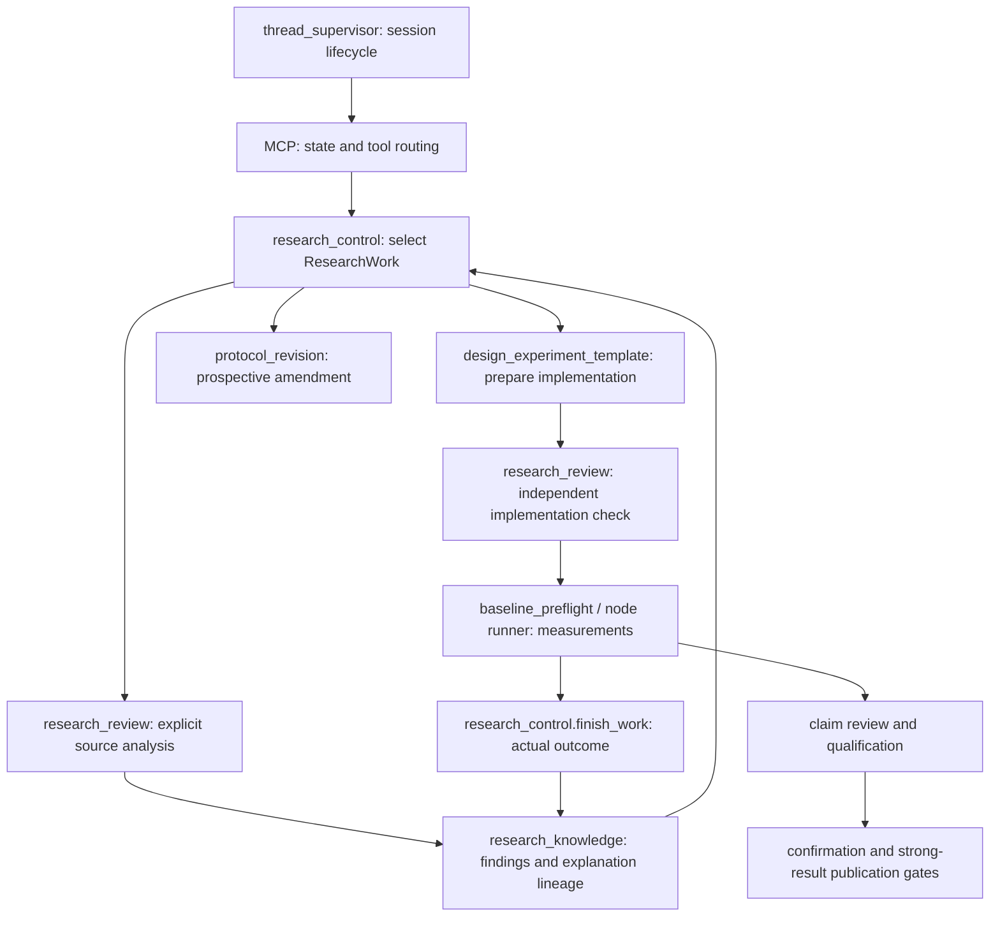

# Research selection after zoom-out

The project uses ResearchWork for a bounded question/procedure and DirectionAttempt
for a scientific research direction. Neither a work completion nor an agent exit
validates a claim. GoalContract and the publication gates retain the strong-result
requirement. No separate domain glossary file was found; terminology here follows
ADR 0014–0016 and the implementation.

`CodexCliAdapter` supplies model execution beneath planner, analysis and review.
It is not a scientific reviewer. `call_budget` limits bounded operator checks;
`OwnedProcessTree` cleans up a call's processes. `mcp_server` translates operational
errors into tool responses and therefore controls whether an outer agent retries.

## Changes and exposures

1. Work selection also performed unbounded code/history inspection. The selector
   now has no tools and receives a shorter role-specific instruction.
2. Compaction removed useful analysis findings along with bulk data. Findings and
   limitations remain visible; source references are for downstream investigation.
3. `allow_local_tools=False` still allowed native delegation/skill discovery outside
   bounded runs. The adapter now disables these routes for that mode too.
4. A stale planned work could remain marked planned after being replaced. It is
   now superseded with a replacement link, preserving explanation lineage.
5. Confirmation eligibility was checked after response caching. It is now checked
   within response validation before persistence, retaining rejection feedback.
6. Generated work prose had no upper bounds. Generation now limits narrative
   field length without truncating accepted scientific content after generation.

The authoritative latest outcome, unresolved predictions on failed measurement,
model-specific caches, budget checkpoint, partial timeout record and owned-process
cleanup from the prior audit remain in force.

## Verification

The live continuation artifacts are in
`runs/e2e/lab3-game-only/luna-selector-20260906-231142`.
The run uses Luna max, one supervisor cycle, at most 300 seconds, four model
launches, 350,000 aggregate initial prompt bytes and 140,000 per call. These bytes
are not provider token usage. No root-authored learner or scientific answer was
injected into the research state.

## Live observation and further corrections

The first live run registered work `82f68a4c…` just before the bounded stop. The
planner took about 196 seconds and used 47,699 input tokens and 10,564 output tokens,
of which 9,301 were reasoning. It correctly identified the latest
unexpected_observations output-contract failure, left all four prior prediction
effects unresolved, and selected a bounded repair of the same diagnostic. No
experiment was run in that first continuation. The initial progress report that
no work had been registered was corrected after inspecting the final MCP event
and persisted current work.

A tiny same-model transport probe returned valid JSON in 5.3 seconds, using 18,410
input and 15 output tokens. This isolates basic CLI availability; it is not research
progress. The default CLI input overhead is therefore nontrivial even for a tiny
user prompt. The actual cause of the planner's remaining reasoning time cannot be
attributed to file reads after local tools were disabled.

The run also showed the outer agent manually reading host research skills despite
automatic discovery being disabled. The subprocess filesystem profile now denies
host skill directories, and the execution coordinator is told to follow the
harness roles rather than reload host workflows. This restriction was added after
the first continuation and applies to subsequent calls.

Timeout-at-shutdown can race receipt saving. Planning now writes raw CLI events to
its invocation directory while the process runs; the bounded call deadline leaves
five seconds to record failure before the supervisor stops. A real subprocess
regression retains emitted events and terminates its detached child on timeout.

A second bounded continuation, `luna-repair-20260906-232152`, resumes the already
planned work without paying to recreate it. Its limits are 240 seconds, three
model calls, 250,000 aggregate initial bytes and 140,000 bytes per call.

The second continuation spent its 240 seconds locating prior requests and reading
harness APIs/tests, without dispatching. The missing execution handoff was then
fixed: current/full research state supplies an unmodified predecessor request with
fresh execution identity, verified source references/hashes, and the existing
exact-text replacement contract. Changed predecessor bytes prevent automatic
reuse. The agent must still implement the repair and pass independent review.

The final continuation, `luna-handoff-20260906-233028`, submitted a real preflight
request in about 75 seconds. The harness agent changed one unexpected_observations
construction from strings to observation/evidence/scope_relation objects. Five
other source files were reused without edits. The request and materialized sources
were retained for the same work. No root-authored scientific patch was supplied.

The reviewer was not launched because its initial prompt exceeded the 140,000-byte
per-call limit. The saved packet is 360,808 bytes plus 10,617 bytes of instructions;
its largest parts are protocol history (107,181), the actual plan (93,236), and
prepared-implementation history (84,145). No experiment ran. The output-contract
repair therefore has not been validated by an actual diagnostic result.

That budget exception had been incorrectly returned as an input rejection requiring
code correction. It now returns a checkpoint, retains the same resumable work and
request, and explicitly says no code correction or scientific conclusion follows.
The denied input size is recorded for future budget diagnosis. This final correction
was verified by replaying the exception at the real preflight-handler boundary;
no further paid run was made. Reviewer invocations now also stream events to disk.

Known unstable-feature notices no longer appear as a generic `completed error`;
actual item errors retain their specific message. The raw event record is preserved.

The original planner deadlock was passed in one measured run, and execution handoff
reached a real dispatch request in the final run. This is not evidence that the
harness has completed research or can produce a publication-level paper. Remaining
review cost and end-to-end experimental validity are not established by these runs.

## Final local verification

Relevant existing checks plus focused regressions: 110 passed, 3 subtests passed
across research_control, codex_cli_adapter, thread_supervisor, research_review and
hypothesis_development. `git diff --check` passed. Pyflakes passed for the changed
runtime/adapter/MCP/research modules; thread_supervisor still has the pre-existing
unused `prod_term` assignment at line 999, unrelated to these changes.

All processes carrying each of the three bounded research budgets were confirmed
terminated. Durations were 301.1, 241.1 and 75.1 seconds respectively. Completion
usage is available for the planner and tiny transport probe, not for all interrupted
outer sessions; those two reported usage records are not the total token cost.
